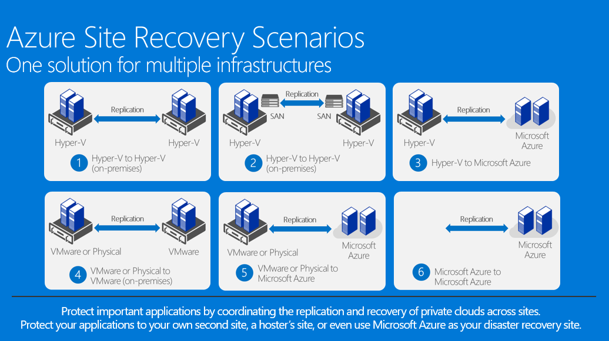
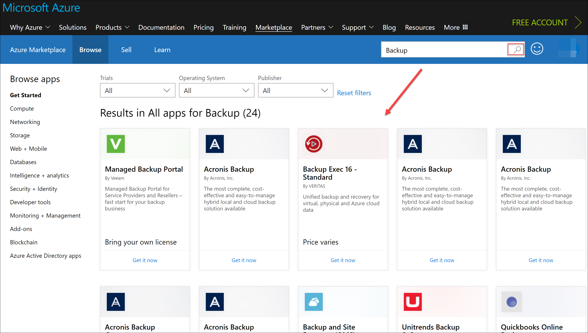
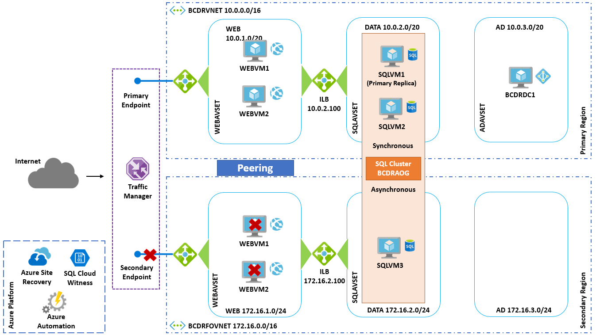
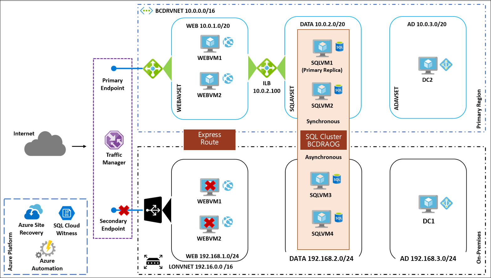

[Business continuity and disaster recovery]

Whiteboard design session trainer guide

[May 2018]

Information in this document, including URL and other Internet Web site references, is subject to change without notice. Unless otherwise noted, the example companies, organizations, products, domain names, e-mail addresses, logos, people, places, and events depicted herein are fictitious, and no association with any real company, organization, product, domain name, e-mail address, logo, person, place or event is intended or should be inferred. Complying with all applicable copyright laws is the responsibility of the user. Without limiting the rights under copyright, no part of this document may be reproduced, stored in or introduced into a retrieval system, or transmitted in any form or by any means (electronic, mechanical, photocopying, recording, or otherwise), or for any purpose, without the express written permission of Microsoft Corporation.

Microsoft may have patents, patent applications, trademarks, copyrights, or other intellectual property rights covering subject matter in this document. Except as expressly provided in any written license agreement from Microsoft, the furnishing of this document does not give you any license to these patents, trademarks, copyrights, or other intellectual property.

The names of manufacturers, products, or URLs are provided for informational purposes only and Microsoft makes no representations and warranties, either expressed, implied, or statutory, regarding these manufacturers or the use of the products with any Microsoft technologies. The inclusion of a manufacturer or product does not imply endorsement of Microsoft of the manufacturer or product. Links may be provided to third party sites. Such sites are not under the control of Microsoft and Microsoft is not responsible for the contents of any linked site or any link contained in a linked site, or any changes or updates to such sites. Microsoft is not responsible for webcasting or any other form of transmission received from any linked site. Microsoft is providing these links to you only as a convenience, and the inclusion of any link does not imply endorsement of Microsoft of the site or the products contained therein.
© 2018 Microsoft Corporation. All rights reserved.

Microsoft and the trademarks listed at https://www.microsoft.com/en-us/legal/intellectualproperty/Trademarks/Usage/General.aspx are trademarks of the Microsoft group of companies. All other trademarks are property of their respective owners.

**Contents**

<!-- TOC -->

- [Trainer information](#trainer-information)
    - [Role of the trainer](#role-of-the-trainer)
    - [Whiteboard design session flow](#whiteboard-design-session-flow)
    - [Before the whiteboard design session: How to prepare](#before-the-whiteboard-design-session-how-to-prepare)
    - [During the whiteboard design session: Tips for an effective whiteboard design session](#during-the-whiteboard-design-session-tips-for-an-effective-whiteboard-design-session)
- [Business continuity and disaster recovery whiteboard design session student guide](#business-continuity-and-disaster-recovery-whiteboard-design-session-student-guide)
    - [Abstract](#abstract)
    - [Step 1: Review the customer case study](#step-1-review-the-customer-case-study)
        - [Customer situation](#customer-situation)
        - [Customer needs](#customer-needs)
        - [Customer objections](#customer-objections)
        - [Infographic for common scenarios](#infographic-for-common-scenarios)
    - [Step 2: Design a proof of concept solution](#step-2-design-a-proof-of-concept-solution)
    - [Step 3: Present the solution](#step-3-present-the-solution)
    - [Wrap-up](#wrap-up)
    - [Additional references](#additional-references)
- [Business continuity and disaster recovery whiteboard design session trainer guide](#business-continuity-and-disaster-recovery-whiteboard-design-session-trainer-guide)
    - [Step 1: Review the customer case study](#step-1-review-the-customer-case-study-1)
    - [Step 2: Design a proof of concept solution](#step-2-design-a-proof-of-concept-solution-1)
    - [Step 3: Present the solution](#step-3-present-the-solution-1)
    - [Wrap-up](#wrap-up-1)
    - [Preferred target audience](#preferred-target-audience)
    - [Preferred solution](#preferred-solution)
    - [Checklist of preferred objection handling](#checklist-of-preferred-objection-handling)
    - [Customer quote (to be read back to the attendees at the end)](#customer-quote-to-be-read-back-to-the-attendees-at-the-end)

<!-- /TOC -->

# Trainer information

Thank you for taking time to support the whiteboard design sessions as a trainer!

## Role of the trainer

An amazing trainer:

-   Creates a safe environment in which learning can take place

-   Stimulates the participant's thinking

-   Involves the participant in the learning process

-   Manages the learning process (on time, on topic, and adjusting to benefit participants)

-   Ensures individual participant accountability

-   Ties it all together for the participant

-   Provides insight and experience to the learning process

-   Effectively leads the whiteboard design session discussion

-   Monitors quality and appropriateness of participant deliverables

-   Effectively leads the feedback process

## Whiteboard design session flow 

Each whiteboard design session uses the following flow:

**Step 1: Review the customer case study (15 minutes)**

Outcome: Analyze your customer's needs

-   Customer's background, situation, needs, and technical requirements

-   Current customer infrastructure and architecture

-   Potential issues, objectives, and blockers

**Step 2: Design a proof of concept solution (60 minutes)**

Outcome: Design a solution and prepare to present the solution to the target customer audience in a 15-minute chalk-talk format.

-   Determine your target customer audience

-   Determine customer's business needs to address your solution

-   Design and diagram your solution

-   Prepare to present your solution

**Step 3: Present the solution (30 minutes)**

Outcome: Present solution to your customer.

-   Present solution

-   Respond to customer objections

-   Receive feedback

**Wrap-up (15 minutes)**

-   Review preferred solution

## Before the whiteboard design session: How to prepare

Before conducting your first whiteboard design session:

-   Read the Student guide (including the case study) and Trainer guide

-   Become familiar with all key points and activities

-   Plan the point you want to stress, which questions you want to drive, transitions, and be ready to answer questions

-   Prior to the whiteboard design session, discuss the case study to pick up more ideas

-   Make notes for later

## During the whiteboard design session: Tips for an effective whiteboard design session

**Refer to the Trainer guide** to stay on track and observe the timings.

**Do not expect to memorize every detail** of the whiteboard design session.

When participants are doing activities, you can **look ahead to refresh your memory**.

-   **Adjust activity and whiteboard design session pace** as needed to allow time for presenting, feedback, and sharing

-   **Add examples, points, and stories** from your own experience. Think about stories you can share that help you make your points clearly and effectively.

-   **Consider creating a "parking lot"** to record issues or questions raised that are outside the scope of the whiteboard design session or can be answered later. Decide how you will address these issues, so you can acknowledge them without being derailed by them.

***Have fun**! Encourage participants to have fun and share!*

**Involve your participants.** Talk and share your knowledge but always involve your participants, even while you are the one speaking.

**Ask questions** and get them to share to fully involve your group in the learning process.

**Ask first**, whenever possible. Before launching into a topic, learn your audience's opinions about it and experiences with it. Asking first enables you to assess their level of knowledge and experience, and leaves them more open to what you are presenting.

**Wait for responses**. If you ask a question such as, "What's your experience with (fill in the blank)?" then wait. Do not be afraid of a little silence. If you leap into the silence, your participants will feel you are not serious about involving them and will become passive. Give participants a chance to think, and if no one answers, patiently ask again. You will usually get a response.

#  Business continuity and disaster recovery whiteboard design session student guide

## Abstract

In this whiteboard design session, you will you will work in a group to design a solution using Azure business continuity and disaster recovery (BCDR) technologies. Your solution  will consider three different types of environments. The first will consist of on-premises VMs running applications that will be migrated to Azure IaaS. Next, Azure IaaS applications that need to be failed over from either on-premises to Azure or between two Azure Regions. Finally, the use of automated failover technologies built into Azure PaaS services App Service and SQL Database will be used for PaaS applications.

At the end of this whiteboard design session, you will be better able to design a solution that leverages various Azure technologies together to build a complex and robust IaaS BCDR plan. 

## Step 1: Review the customer case study 

**Outcome** 

Analyze your customer’s needs.

Timeframe: 15 minutes 

Directions: With all participants in the session, the facilitator/SME presents an overview of the customer case study along with technical tips. 

1.  Meet your table participants and trainer 
2.  Read all of the directions for steps 1–3 in the student guide 
3.  As a table team, review the following customer case study

### Customer situation

Contoso Insurance (CI), is a multinational corporation, headquartered in Miami providing insurance solutions in North America, Europe, and Australia. Its products include accident and health insurance, life insurance, travel, home, and auto coverage. CI manages data collection services by sending mobile agents directly to the insured to gather information as part of the data collection process for claims from an insured individual. These mobile agents are based all over the world and are residents of the region in which they work. Mobile agents are managed remotely, and each regional corporate office has a support staff responsible for scheduling their time based on requests that arrive to the system.??

CI currently hosts their primary corporate systems at co-locations facilities within each geo-political region and manage all IT operations for the system. These sites include Miami, London, and Sydney all of which are connected to the Internet and each other via a combination of VPNs and private WANs.

CI is expecting significant growth within the United States and abroad---they foresee the need to scale their system, and their IT operations staff. "We are exploring a move to Microsoft Azure to simplify some of the operations management overhead and associated costs, beginning with their U.S. datacenter and then those in Europe and Australia", says Naomi Sharp, VP of Datacenters. Given CI's international footprint, they need to be operational 24x7. As such they have concerns about how they will address business continuity and disaster recovery (BCDR), in their move to the cloud.

CI has completed a cloud assessment of their applications and have classified their target applications into three types that they wish to focus on for their implementation of Azure BCDR technologies:

**Workgroup Applications:** These are typically smaller applications that run on a single VMs and are used by 25 or fewer employees. These applications have been developed locally by the Regional IT team and are based on Linux, Apache, PHP, and MySQL (LAMP). These applications are important to the various business units and need to be managed and require backup but won't need mission-critical failover capabilities. The primary concern is how to migrate these applications as quickly as possible to Azure with minimal downtime.

**Enterprise Applications:** The applications in this classification are mission critical to the business and have been developed using ASP.NET and SQL Server Enterprise over many years. They are deployed using Windows Clustering and SQL Always On Availability Groups (AOG), to ensure failover of databases during an outage. These applications are running in the various datacenters around the world but currently, have no DR capabilities. They are backed up using a third-party software with a mix of online disk backup and ultimately then archived to tape and sent offsite for storage. Given their status as core to the business, they require complex DR failover and failback capabilities whether they are running in an Azure region or one of the colocation facilities. "There is critical concern about the Miami datacenter given how hurricane-prone the area is and the intensity of the storms which could cause outages lasting weeks," says Adam Brooks Director of Continuity of Business (COB). "With only a few months until the next hurricane season, we need to get these applications protected in Azure. Some will be migrated immediately, and others will need to be extended to failover to the cloud but will need to allow for failback to the on-premises."

**Global, Mobile, and API Web Applications:** CI has leveraged their experience with ASP.NET and SQL Server to build applications that are Azure PaaS ready. These applications primarily service their external customers and the mobile agents. These include applications for consumers and their employees in the field dealing with claims. "We have prototyped these applications in Azure App Services and SQL Database with success but need a plan for how they will be implemented for high-availability and automatic failover," says Mrs. Kamakshi. "These applications are global, so we want to make sure that they are distributed around the world and that users will be directed to the closest point of presence (POP) but will never get an error if there is a local issue."

### Customer needs 

1.  CI needs to automate their backup and recovery of their solutions, not just individual components. They need a strategy not just point solutions. They are still backing up to tape and want to modernize this approach. The COB team is demanding that the recovery be testable before an event occurs.

2.  CI wants to insure they have the right breadth and depth of continuity protection. In the case of a lights-out event, they want to be able to control how the systems failover.

3.  CI wants to move very fast on some of their migrations to Azure. They need a plan for handling these migrations with very little downtime to the business.

4.  CI has struggled with DR solutions with respect to the Data tier of their application. They need to understand how this will work with IaaS and PaaS solutions for SQL Server and SQL DB.

5.  They have new solutions they are building, and they want to set standards for how they are designed with BCDR in mind

6.  CI's corporate datacenter in the US is in a hurricane-prone region, and they need a backup datacenter that mirrors the core functions they have here. They don't want to build another datacenter.

### Customer objections 

1.  With the move to the cloud, they are uncomfortable with any situation that assumes the cloud provider will handle their fail-over

2.  They have many systems that need to be accounted for and they aren't sure if the tools really exist to give them the business continuity they desire

3.  They want to know their BCDR solution is secure

4.  CI has heavily invested in a third-party backup solution but want to use Azure as their archive. Does Azure support this?

### Infographic for common scenarios

![The Native Azure Backup Option one has an on-premises solution of one SharePoint and one SQL virtual machine that use an Azure backup server. On-premises uses the internet to upload to Azure Backup, which then downloads for App/Item-level restore. Option two has a solution of one SharePoint and one SQL virtual machine that use either a Commvault Simpana or VCC for Enterprise machine. This solution uses the internet to upload to Azure Storage (blob), which then downloads for App/Item-level restore.](images/Whiteboarddesignsessiontrainerguide-Businesscontinuityanddisasterrecoveryimages/media/image6.png "Azure Backup and third-party back solutions")

## Step 2: Design a proof of concept solution

**Outcome** 

Design a solution and prepare to present the solution to the target customer audience in a 15-minute chalk-talk format.  

Timeframe: 60 minutes

**Business needs**

Directions: With all participants at your table, answer the following questions and list the answers on a flip chart. 

1.  Who should you present this solution to? Who is your target customer audience? Who are the decision makers? 
2.  What customer business needs do you need to address with your solution?

**Design** 

Directions: With all participants at your table, respond to the following questions on a flip chart.

*Provide an overview of the technologies and the implementation at a high-level. How will you use Azure's BCDR technologies to meet the Customer's needs?*

1.  Azure Regions

    -   Which regions should be deployed in support of the goals of the client?

    -   Why did you select these regions?

2.  Backup

    -   How can each part of their solution be backed up?

    -   How can they sunset the use of tape archive?

    -   Can they continue to use their third-party backup vendor?

3.  Disaster Recovery

    -   What DR Solutions will be leveraged for the implementation at CI?

4.  Design a HA and BDCR solution for each of the three application classifications. At a high-level provide details of your implementation. Make sure to document your design with a diagram along with addressing the questions.

-   Workgroup Applications

    -   What Azure BCDR technologies will you implement for this classification?

    -   How will you migrate these VMs to Azure?

    -   Can you test the migration before going live?

    -   Given this will be an IaaS implementation, provide details of how you will provide HA and Failover capabilities to these VMs once they are in Azure

-   Enterprise Applications

    -   What Azure BCDR technologies will you implement for this classification?

    -   Document how you will implement both types of implementations:

        1.  Migrate to Azure and support Azure Region to Region Failover

        2.  Remain on-premises for primary, but support Hyper-V to Azure Region Failover

    -   How will SQL Always On Availability Groups be set up in order to support both of these scenarios?

    -   What Azure technology, which is commentary to DR, will you implement to deal with application specific tasks such as Pre-Actions and Post-Actions during a failover?

    -   Given this will be an IaaS implementation, provide details of how you will provide HA and Failover capabilities to these VMs once they are in Azure

    -   How will you direct web traffic to the active site?

-   Global, Mobile and API Web Applications

    -   What Azure BCDR technologies will you implement for this classification?

    -   Given this will be a PaaS implementation, provide details of how you will provide HA and Failover capabilities to these VMs once they are in Azure

    -   How will SQL Database be set up to support both scenarios?

    -   What Azure technology and/or DevOps tools, will you implement to deal with application specific tasks such as Pre-Actions and Post-Actions during a failover?

    -   How will you direct web traffic to the different POPs around the world?

**Customer Objections**

Provide details on how you will address each of the objections that were put forward by the client.

**Prepare**

Directions: With all participants at your table: 

1.  Identify any customer needs that are not addressed with the proposed solution 
2.  Identify the benefits of your solution
3.  Determine how you will respond to the customer’s objections

Prepare a 15-minute chalk-talk style presentation to the customer. 

## Step 3: Present the solution

**Outcome**
 
Present a solution to the target customer audience in a 15-minute chalk-talk format.

Timeframe: 30 minutes

**Presentation** 

Directions:

1.  Pair with another table
2.  One table is the Microsoft team and the other table is the customer
3.  The Microsoft team presents their proposed solution to the customer
4.  The customer makes one of the objections from the list of objections
5.  The Microsoft team responds to the objection
6.  The customer team gives feedback to the Microsoft team 
7.  Tables switch roles and repeat Steps 2–6

##  Wrap-up 

Timeframe: 15 minutes

Directions: Tables reconvene with the larger group to hear the facilitator/SME share the preferred solution for the case study. 

##  Additional references
|    |            |       
|----------|:-------------:|
| **Description** | **Links** |
| Overview of Azure Site Recovery | <https://docs.microsoft.com/en-us/azure/site-recovery/site-recovery-overview/> |
| Prepare Azure resources for replication of on-premises machines | <https://docs.microsoft.com/en-us/azure/site-recovery/tutorial-prepare-azure/> |
| Migrate on-premises machines to Azure | <https://docs.microsoft.com/en-us/azure/site-recovery/tutorial-migrate-on-premises-to-azure/> |
| Azure to Azure replication architecture | <https://docs.microsoft.com/en-us/azure/site-recovery/concepts-azure-to-azure-architecture/> |
| Hyper-V to Azure replication architecture | <https://docs.microsoft.com/en-us/azure/site-recovery/concepts-hyper-v-to-azure-architecture/> |
| Azure to Azure Support Matrix | <https://docs.microsoft.com/en-us/azure/site-recovery/site-recovery-support-matrix-azure-to-azure/> |
| Support matrix for Hyper-V replication to Azure | <https://docs.microsoft.com/en-us/azure/site-recovery/support-matrix-hyper-v-to-azure/> |
| Protect SQL Server using SQL Server disaster recovery and Azure Site Recovery | <https://docs.microsoft.com/en-us/azure/site-recovery/site-recovery-sql/> |
| Overview: Failover groups and active geo-replication | <https://docs.microsoft.com/en-us/azure/sql-database/sql-database-geo-replication-overview/> |
| What is Traffic Manager? | <https://docs.microsoft.com/en-us/azure/traffic-manager/traffic-manager-overview/> |
| Traffic Manager Routing Methods | <https://docs.microsoft.com/en-us/azure/traffic-manager/traffic-manager-routing-methods/> |
| Traffic Manager Endpoints | <https://docs.microsoft.com/en-us/azure/traffic-manager/traffic-manager-endpoint-types/> |
| Backup Solution Architectures | <https://azure.microsoft.com/en-us/solutions/architecture/backup-archive-on-premises-applications/> |

# Business continuity and disaster recovery whiteboard design session trainer guide 

## Step 1: Review the customer case study

-   Check in with your table participants to introduce yourself as the trainer

-   Ask, "What questions do you have about the customer case study?"

-   Briefly review the steps and time frames of the whiteboard design session

-   Ready, set, go! Let the table participants begin

## Step 2: Design a proof of concept solution

-   Check in with your tables to ensure that they are transitioning from step to step on time

-   Provide some feedback on their responses to the business needs and design

    -   Try asking questions first that will lead the participants to discover the answers on their own

-   Provide feedback for their responses to the customer's objections

    -   Try asking questions first that will lead the participants to discover the answers on their own

## Step 3: Present the solution

-   Determine which table will be paired with your table before Step 3 begins

-   For the first round, assign one table as the presenting team and the other table as the customer

-   Have the presenting team present their solution to the customer team

    -   Have the customer team provide one objection for the presenting team to respond to

    -   The presentation, objections, and feedback should take no longer than 15 minutes

## Wrap-up

Timeframe: 15 minutes

Directions: Tables reconvene with the larger group to hear the facilitator/SME share the preferred solution for the case study.

##  Preferred target audience

-   Naomi Sharp, VP of Datacenters

-   Adam Brooks, Directory of Continuity of Business (COB)

-   Database Architects / Administrators Management

-   Application Owners and Services Managers

-   Infrastructure, Virtualization, Storage, and Networking Teams

## Preferred solution

*Provide an overview of the technologies and the implementation at a high-level. How will you use Azure's BCDR technologies to meet the Customer's needs?*

1.  Azure Regions

-   Which regions should be deployed in support of the goals of the client?

    -   North America: East US2, Central US

    -   Europe: UK West, UK South

    -   Australia: Australia East, Australia Southeast

-   Why did you select these regions?

    -   These regions are closest to the locations of their current operations and datacenters

    -   Each of these regions is considered "Region Pairs"

    -   Miami, London and Sydney all support express route, so this will be implemented along with the Premium SKU so all regions can see each other

2.  Backup

-   How can each part of their solution be backed up?

    -   IaaS: These deployments will be backed up using an Azure implementation of their third-party backup

    -   PaaS: Azure App Service and SQL Database have built in Backup services that must be implemented. These are robust solutions, but their features are dependent upon the select and SKUs that CI selects during the provisioning of these services.

-   How can they sunset the use of tape archive?

    -   The ability to extend their third-party backup solution to use Azure allows it to become an archive target. This means that the customer can move from tapes to the cloud for the final resting place for their backups.

-   Can they continue to use their third-party backup vendor?

    -   The majority of the well-known backup vendors have solutions that are available from the Azure Marketplace or are compatible with Azure as a backup archive target. These allow customers to use extend their investment to the cloud and backup VMs that are running in Azure.

3.  Disaster Recovery

-   What DR Solutions will be leveraged for the implementation at CI?

    -   Azure Site Recovery will be the primary BCDR Servers that is used for DR by CI. The service will be used as a Migration Tool as well as a COB tool for failovers between either on-premises Hyper-V implementations or between two Azure Regions for IaaS deployments.

    -   Design a HA and BDCR solution for each of the three application classifications. At a high-level provide details of your implementation. Make sure to document your design with a diagram along with addressing the questions.

4.  Workgroup Applications

-   What Azure BCDR technologies will you implement for this classification?

    -   Given these are single VMs they will be protected locally using Azure Site Recovery to ensure they can be failed over to Azure in case of an outage

-   How will you migrate these VMs to Azure?

    -   The VMs will be migrated to Azure using ASR. This is a one direction failover, and once the VM is up and running and there is verification that all is working properly, the migration will be completed with just one selection in the Azure portal.

    -   Once they are migrated to Azure, they will be re-protected to failover to the region pair that is assigned to their area of the world

-   Can you test the migration before going live?

    -   Once the VM is protected, ASR provides the ability to do a test failover to a disconnected Azure virtual network. This meets the requirements of the COB team.

-   Given this will be an IaaS implementation, provide details of how you will provide HA and Failover capabilities to these VMs once they are in Azure

    -   The VM will be implemented using Managed disks and Premium storage. By using Managed disks there is better fault tolerance and with Premium storage the VM will be covered by a 99.9% SLA even for single VM applications.

        

5.   Enterprise Applications

-   What Azure BCDR technologies will you implement for this classification?

    -   Azure Site Recovery will be leveraged for these applications

-   Document how you will implement both types of implementations:

    -   Migrate to Azure and support Azure Region to Region Failover

        1.  The migration to Azure will be completed using a combination of Azure Site Recovery and SQL Always On Availability Groups. First the AOG will be extended to have Asynchronous replicas running in an Azure Virtual Network over the ExpressRoute Circuit. This allows for an extension of the database to Azure. During the Failover for the migration the Asynchronous side of the AOG will be made a Synchronous replica and then a planned failover will make one of the Azure nodes the primary replica. Once this is completed then ASR will be used to failover the Web tier to Azure. The migration will then be completed using the Azure portal.

        2.  Once migrated to Azure the application will be re-protected to failover to the region pair that is assigned to their area of the world.

            

6.  Remain on-premises for primary, but support Hyper-V to Azure Region Failover

-   Like the migration, the AOG will be extended to have Asynchronous replicas running in an Azure Virtual Network over the ExpressRoute Circuit. This allows for an extension of the database to Azure. Azure Site Recovery will then be configured for a forced failover which will make one of the Asynchronous nodes in Azure a Synchronous replica and the primary replica. Once this is completed then ASR will be used to failover the Web tier to Azure.

-   Once the outage on-premises has been resolved, and the SQL nodes are back online in the local datacenter a planned failover back using ASR will be executed. This will consist of first resuming data movement on the local nodes running on-premises. Once they are synchronized then a planned failover using ASR will assign a new primary replica locally and fail back the web tier.

    

-   How will SQL Always On Availability Groups be set up in order to support both of these scenarios?

    -   SQL Always On will have multiple Replicas that are built with Synchronous replication and Automatic failover in the Primary site. The Secondary site will have at least one Asynchronous replication and Manal failover partner. This will be identical regardless if it is on-premises to Azure or Azure Region to Region.

-   What Azure technology, which is commentary to DR, will you implement to deal with application specific tasks such as Pre-Actions and Post-Actions during a failover?

    -   Azure Automation Runbooks will need to be written to support these failovers as they are complex and must be done in the proper sequence. Using Runbooks will allow for single click failovers in both direction and won't involve any manual steps (although they can be built into the plan if the customer desires).

-   Given this will be an IaaS implementation, provide details of how you will provide HA and Failover capabilities to these VMs once they are in Azure

    -   These are mission critical systems that have multiple VMs, so they will be configured to leverage Managed Disks, Availability Sets and Premium disks. This provides for the most fault tolerance available to an Azure VM and will be eligible for a 99.95% SLA. The Internal Load balancer will also be used in front of the SQL Always On nodes that are running in Azure.

-   How will you direct web traffic to the active site?

    -   The Traffic Manager will be used for these implementations given that they are a Primary / Secondary failover type of deployment the Priority Routing method is the best to implement. If the Primary goes down the Monitor Status will show as Degraded and traffic will be send to the Secondary once it is up and running and shows a Monitor Status of Online.

7.  Global, Mobile and API Web Applications

-   What Azure BCDR technologies will you implement for this classification?

    -   Given that these are PaaS Services the implementation is much different than IaaS. ASR won't be required to ensure availability of these applications.

-   Given this will be a PaaS implementation, provide details of how you will provide HA and Failover capabilities to these VMs once they are in Azure

    -   Multiple points of presence for these applications will be deployed in the Azure Regions discussed. Given the nature of their business, there will always be at least two POPs per region. The use of Auto scaling will also be leveraged to ensure that the site can deal with traffic spikes.

-   How will SQL Database be set up to support both of these scenarios?

    -   The SQL Database will be implemented using Failover Groups. This allows for geo-replication with a single listener name like the SQL Always On Availability Groups. This dramatically simplifies issues of connection strings within the App Services Application Settings. By pointing at the Listener rather than a server, there should never be an issue if a Database is failed over.

-   What Azure technology and/or DevOps tools will you implement to deal with application specific tasks, such as Pre-Actions and Post-Actions during a failover?

    -   Azure Automation could be used again if the application required some type of custom configuration changes during a failure. The Runbooks could be designed to be triggered with a webhook, so that event could fire when there is a failure. Other CI/CD tools could be implemented to deal with issues that arise or to perform automated tests based on failovers.

-   How will you direct web traffic to the different POPs around the world?

    -   Depending on the application on public endpoints, CI should at a minimum enable Priority routing to failover traffic to secondary locations. Considering Weighted routing to avoid overwhelming a failover target during a failure, and instead distribute the load across multiple endpoints. In situations where the endpoint is expected to be deployed in multiple regions, they should consider Performance method which will route clients to provide the lowest network latency. In some cases, they may need to consider the Geographic method for apps and API's that have data sovereignty considerations and traffic needs to be routed according to the region, country or state/province from which the DNS query of the client originates.

##  Checklist of preferred objection handling

1.  With the move to the cloud, they are uncomfortable with any situation that assumes the cloud provider will handle their fail-over

    *Potential Answer:*

    Using ASR CI will be able to handle all of their own DR. They will be using familiar tools with the Azure Portal and Hyper-V.

2.  They have many systems that need to be accounted for, and they aren't sure if the tools really exist to give them the business continuity they desire

    *Potential Answer:*

    There are BCDR tools built into the all of the different application classification they have at CI, including Linux.

3.  They want to know their BCDR solution is secure.

    *Potential Answer:*

    All of the traffic and data used for all Azure BCDR features is secured both at rest and in-transit. As a result, there is no difference in this data and any other data that is running or stored in Azure.

4.  They have heavily invested in a third-party backup solution but want to use Azure as their archive. Does Azure support this?

    *Potential Answer:*

    Azure has support for third-party backup providers through the Azure Marketplace. It's possible to both backup VMs using these tools by deploying them to Azure IaaS or by extending the backup infrastructure to use the Azure cloud as an archive target.

## Customer quote (to be read back to the attendees at the end)

*"Azure has BCDR built into each classification of application that we have here at Contoso Insurance. This depth and breadth will allow us to meet both our business needs and regulatory requirements for our applications. Not to mention ensuring our agents are able to help our customers in their time of need."*

- Naomi Sharp, VP of Datacenters
